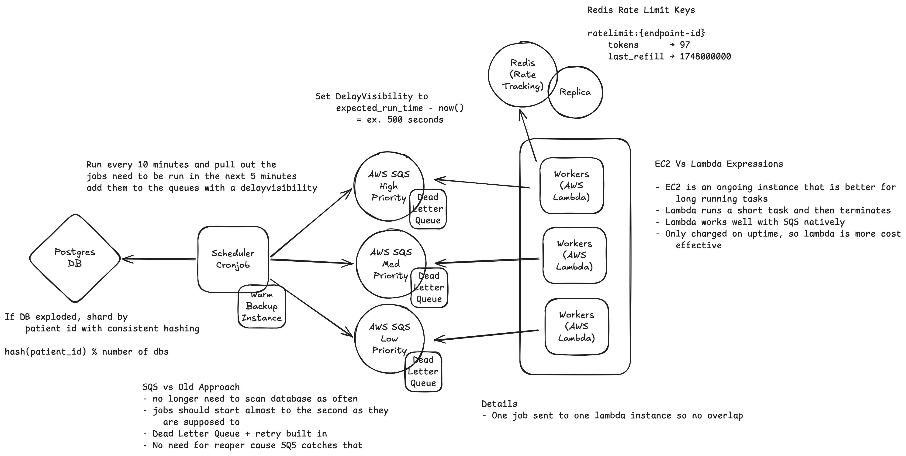

# Scaling to 10M Patients

## Current State (5K)
- Postgres + Redis sorted set + stateless Python workers
- Scheduler polls DB every N seconds, pushes to Redis queue
- Workers block on `BZPOPMIN`, token bucket rate limiting per endpoint

---

## Bottlenecks at Scale
- Scheduler scanning 10M rows every N seconds → full table scan, slow
- Single Redis instance → SPOF
- Worker count is manual → can't track queue depth automatically
- Single Postgres → write throughput ceiling under sustained load

---

## High-Scale Architecture

### Scheduler → EventBridge Cronjob
- Runs every 10 min, pulls jobs due in next window
- Sets SQS `DelayVisibility = expected_run_time - now()` so messages arrive exactly when due
- Eliminates polling entirely
- Warm standby with DB advisory lock to prevent double-scheduling

### Queue → 3 SQS Priority Queues
- Urgent / Normal / Low — each with its own DLQ
- No reaper needed — SQS visibility timeout handles worker crashes automatically
- DLQ captures permanently failed jobs for inspection

### Workers → Lambda
- One invocation per job, no overlap possible
- Provisioned Concurrency on urgent queue — eliminates cold starts
- Low priority queue uses on-demand — cold starts acceptable
- Auto-scales with queue depth via reserved concurrency

### Rate Limiting → ElastiCache Redis
- Same Lua token bucket, shared across all Lambda invocations
- Redis replica for HA — auto-elected on failure

### Database → Sharded Postgres
- Shard by `hash(patient_id) % N` — all data for a patient on one shard, no cross-shard writes
- Start with time-based partitioning on `refresh_jobs` first (zero app changes)
- `studies` / `ehr_endpoints` duplicated on every shard (small, read-only — avoids cross-shard joins)

---

## Tradeoffs
- Lambda cold starts ~100ms — fine for async jobs, not for user-triggered urgent refreshes (mitigated by Provisioned Concurrency)
- SQS `DelayVisibility` max is 15 min — EventBridge Scheduler needed for weekly/bi-weekly studies
- Hash sharding makes rebalancing painful — pick shard count with headroom upfront
